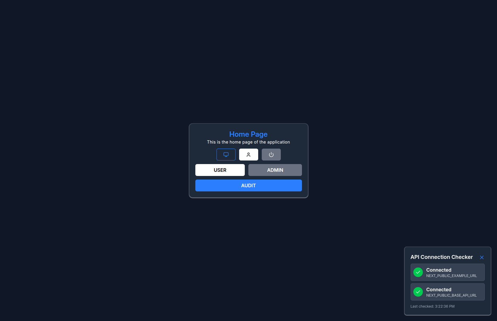
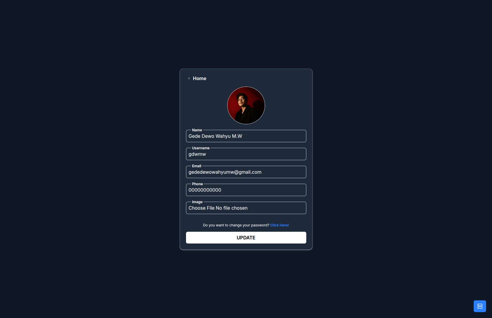
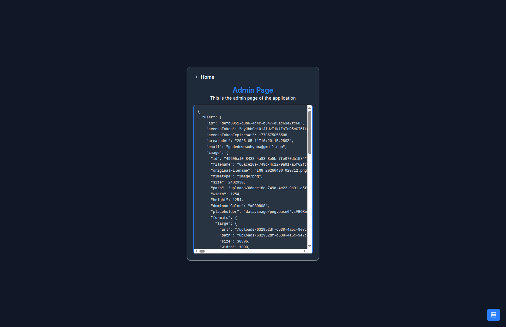
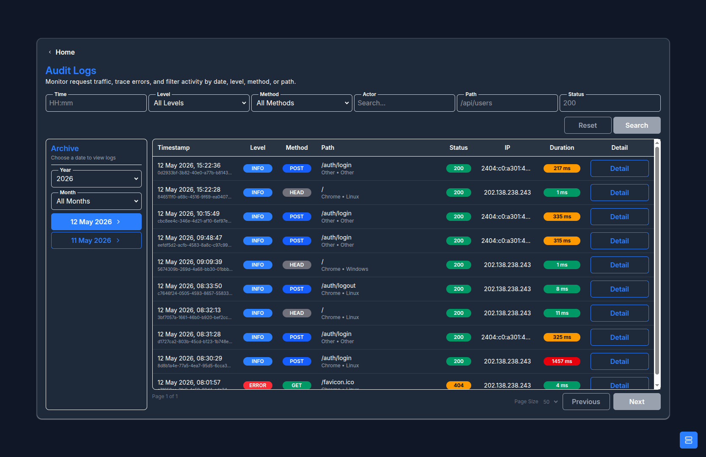
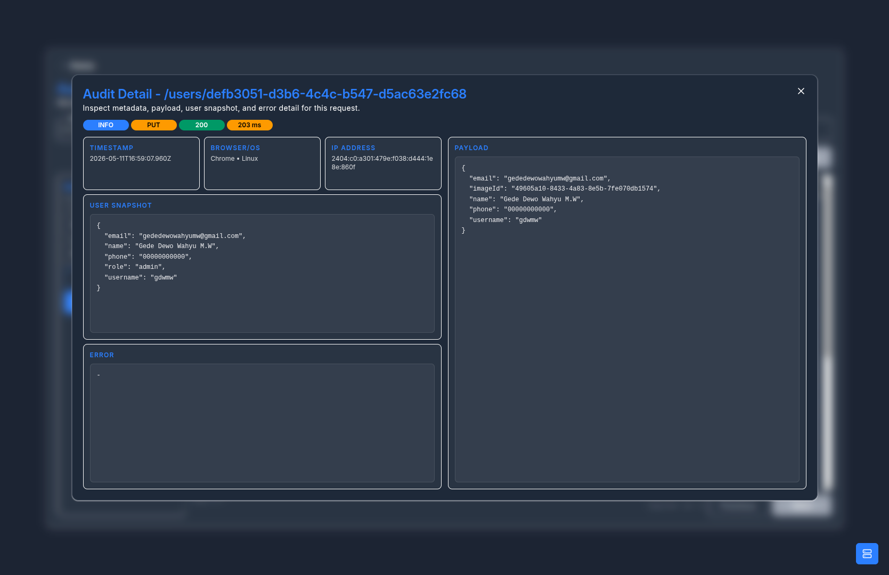
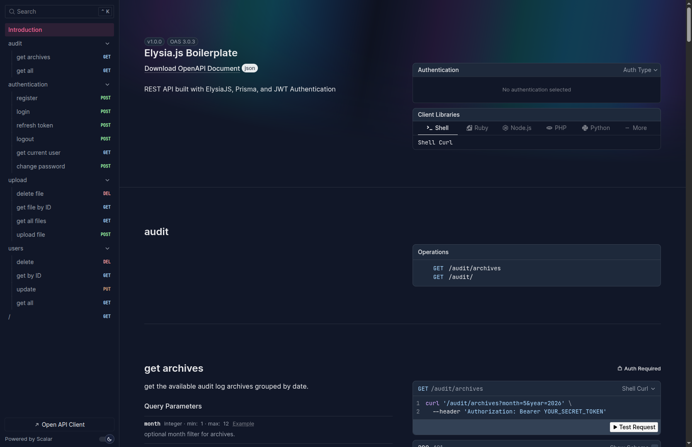
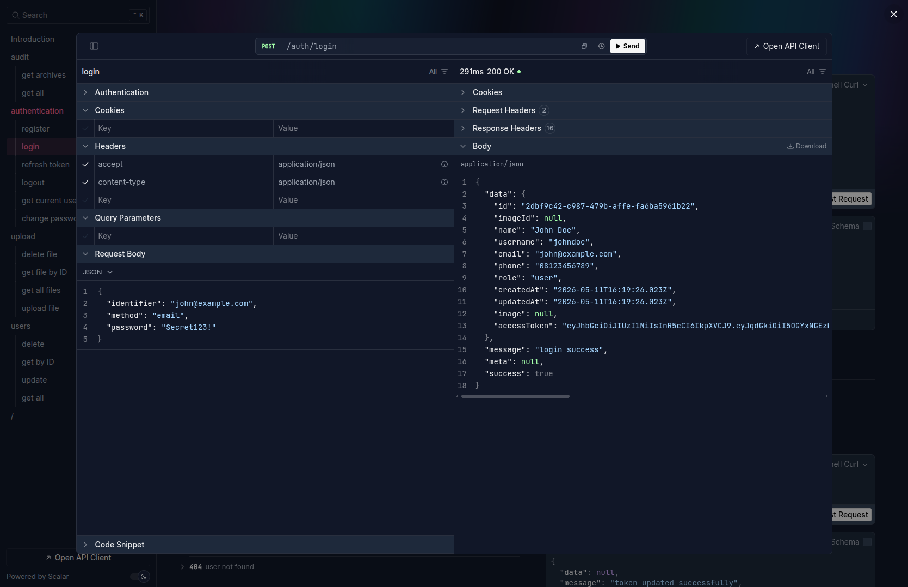

# 🚀 Fullstack Boilerplate (Turborepo + Next.js + Elysia.js)

Boilerplate by [Gede Dewo Wahyu M.W](https://github.com/gdwmw)


[](https://sonarqube.zettara.com/dashboard?id=turborepo)

---

## 📖 Description

This monorepo is a fullstack starter kit based on Turborepo, consisting of:

- 🖥️ `apps/next`: frontend application using Next.js
- ⚙️ `apps/elysia`: REST API using Elysia.js + Prisma

This boilerplate provides common foundations often needed in production projects such as JWT authentication, form validation, state management, theme management, file uploads, and Storybook for UI development.

This project also supports request/audit log compression using `zstd` on the Elysia.js backend.

---

## ✨ Main Features

- 🏗️ Monorepo architecture with Turborepo + pnpm workspace
- 🎨 Frontend with Next.js + Tailwind CSS
- 🔧 Backend with Elysia.js + Prisma + PostgreSQL
- ⚡ Redis for token blocklist/session support
- 🗜️ `zstd` compression for archived request/audit logs and database backups
- 🔐 JWT authentication
- 📝 Form handling (`react-hook-form` + `zod`)
- 📚 Storybook for UI components
- 🧹 Linting, formatting, and type-checking

---

## 🧰 Tech Stack

- **Monorepo**: Turborepo, pnpm
- **Frontend**: Next.js, Tailwind CSS, Jotai, React Hook Form, Zod
- **Backend**: Elysia.js, Prisma, PostgreSQL, JWT, zstd (log and DB backup compression)
- **Tooling**: ESLint, Prettier, Husky, Commitizen

---

## ⚙️ Prerequisites

Make sure the following are installed:

- 🟢 Node.js `>= 22.22.1`
- 📦 pnpm `>= 11`
- ⚡ Bun `>= 1.3.6` (for running the Elysia API)
- 🐘 PostgreSQL
- 🧰 PostgreSQL client tools (`pg_dump`, `pg_restore`)
- 🔴 Redis
- 🗜️ zstd (required for log compression/decompression)

---

## 🚀 Quick Start

1. **Clone repository**

```bash
git clone https://github.com/gdwmw/Fullstack-Boilerplate.git
cd Fullstack-Boilerplate
```

1. **Install dependencies**

```bash
pnpm install
```

1. **Setup environment variables**

```bash
pnpm cpenv
```

1. **Configure `.env`**

Update at least:

- `apps/elysia/.env`: database connection, JWT secret, and API configuration
- `apps/next/.env`: API/backend URL and other frontend configurations

1. **Ensure services are running**

- 🐘 PostgreSQL must be active (`DATABASE_URL`)
- 🔴 Redis must be active (`REDIS_URL`)

1. **Generate Prisma Client and run migrations**

```bash
pnpm generate
pnpm migrate
```

1. **Run development mode**

```bash
pnpm dev
```

1. **Access the application**

- 🌐 Frontend: [http://localhost:3000](http://localhost:3000)
- 🔗 API: [http://localhost:1337](http://localhost:1337)
- 📄 Swagger: [http://localhost:1337/swagger](http://localhost:1337/swagger)

---

## 📁 Folder Structure

```text
.
├── apps
│   ├── next        # Next.js frontend
│   └── elysia      # Elysia.js backend + Prisma
├── packages        # Shared packages/config across apps
└── turbo.json      # Turborepo configuration
```

---

## 📜 Important Scripts

- ▶️ `pnpm dev` - run all apps in development mode
- 🏗️ `pnpm build` - build all apps/packages
- 🧹 `pnpm lint` - lint the entire workspace
- 🔍 `pnpm check-types` - TypeScript type-check
- ⚙️ `pnpm generate` - generate Prisma client
- 🗄️ `pnpm migrate` - run Prisma migrations
- 🎨 `pnpm prettier` - format codebase

---

## 🧾 Commit Guideline

This project uses Commitizen (`pnpm commit`).

---

## 🤝 Contribution

1. Fork repository
2. Create branch (`feat/your-feature`)
3. Run checks
4. Commit & PR

---

## ❓ Q&A / Help

Include:

- Context
- Error message
- Reproduction steps

---

## ⚖️ License

MIT License
