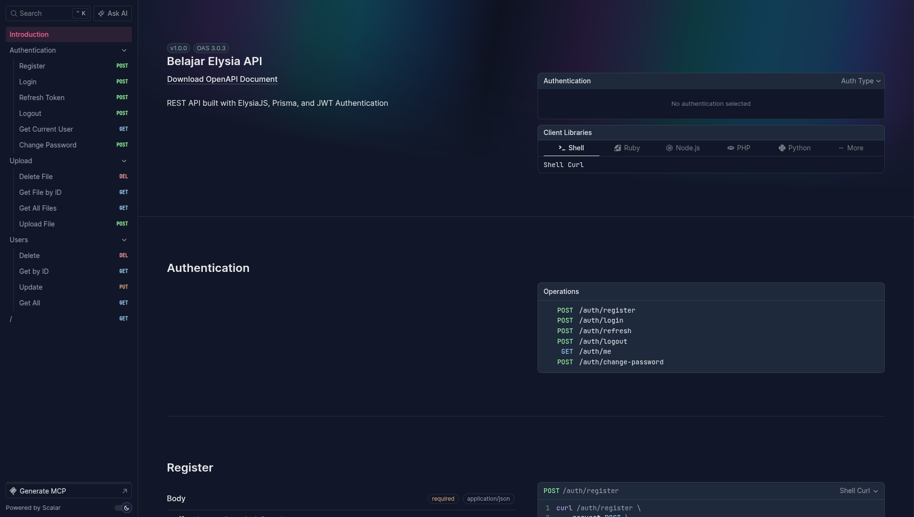
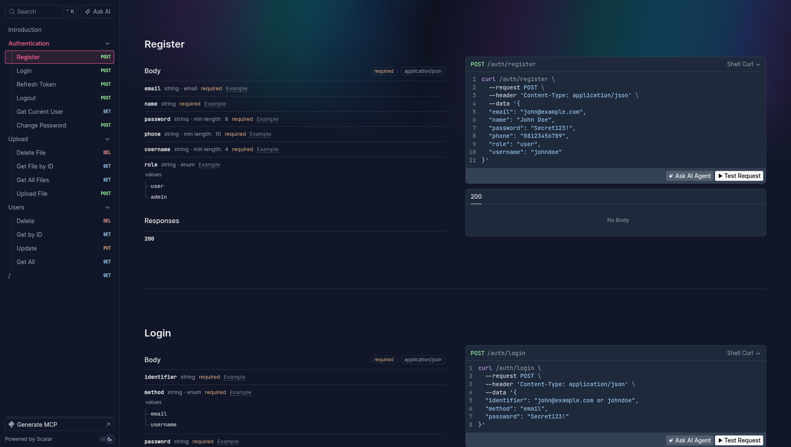
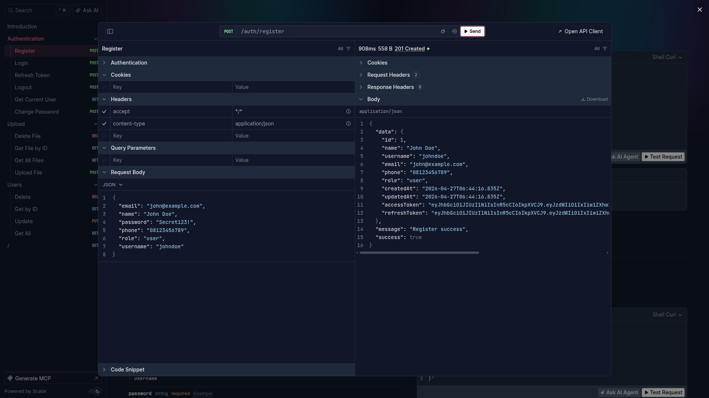

# Elysia.js Boilerplate

Boilerplate By [Gede Dewo Wahyu M.W](https://github.com/gdwmw) ❤️

## Boilerplate Description 📖

This boilerplate is a REST API built with ElysiaJS running on Bun runtime. It includes features such as JWT authentication, file upload handling, Swagger documentation, Prisma ORM with PostgreSQL, CORS configuration, and structured modular routing.

## Boilerplate Structure 📂

Below is the primary directory structure of the boilerplate:

```
└── 📁Elysia.js-Boilerplate
    └── 📁prisma
        └── 📁models
            ├── files.prisma
            ├── users.prisma
        ├── schema.prisma
    └── 📁src
        └── 📁api
            └── 📁auth
                ├── index.ts
                ├── route.ts
                ├── schema.ts
                ├── service.ts
                ├── swagger.ts
                ├── type.ts
            └── 📁upload
                ├── index.ts
                ├── route.ts
                ├── schema.ts
                ├── service.ts
                ├── swagger.ts
                ├── type.ts
            └── 📁users
                ├── index.ts
                ├── route.ts
                ├── schema.ts
                ├── service.ts
                ├── swagger.ts
                ├── type.ts
            ├── index.ts
        └── 📁constants
            ├── index.ts
            ├── omits.ts
            ├── responseMessage.ts
            ├── responseTemplate.ts
            ├── schemaMessage.ts
        └── 📁libs
            ├── index.ts
            ├── prisma.ts
        └── 📁utils
            └── 📁handle-prisma-error
                ├── extract.ts
                ├── handlePrismaError.ts
                ├── index.ts
            ├── index.ts
            ├── verifyAccessToken.ts
        ├── index.ts
```

### Structure Explanation 📚

- **/prisma**: Prisma schema and model definitions. Each entity (`files`, `users`) has its own model file under `models/`.
- **/src/api**: Modular route handlers organized by domain (`auth`, `upload`, `users`). Each module contains `route`, `schema`, `service`, `swagger`, and `type` files.
- **/src/constants**: Application-wide constants including response messages, response templates, schema messages, and field omits.
- **/src/libs**: Library wrappers, including the Prisma client instance.
- **/src/utils**: Utility functions covering Prisma error handling and JWT access token verification.
- **/src/index.ts**: Application entry point — initializes Elysia with CORS, Swagger, and all route modules.

## Installation 🚀

To get started, follow these steps:

1. **Clone the repository**

   ```bash
   git clone https://github.com/gdwmw/Elysia.js-Boilerplate.git
   cd Elysia.js-Boilerplate
   ```

2. **Install dependencies**

   ```bash
   bun install
   ```

3. **Set up environment variables**

   ```bash
   bun run cpenv
   ```

4. **Set `ELYSIA_PORT` to your desired port**

   ```bash
   ELYSIA_PORT=1337
   ```

5. **Generate a base64 value for `JWT_ACCESS_SECRET` and `JWT_REFRESH_SECRET`**

   ```bash
   bun run base64
   ```

6. **Generate Prisma client**

   ```bash
   bun run generate
   ```

7. **Run database migrations**

   ```bash
   bun run migrate
   ```

8. **Run the development server**

   ```bash
   bun run dev
   ```

9. **Access the application**

   Open your browser and navigate to [http://localhost:1337](http://localhost:1337).  
   Swagger documentation is available at [http://localhost:1337/swagger](http://localhost:1337/swagger).

## Commit Guidelines 📝

When committing changes with `bun run commit`, follow these steps:

1. **Prepare your changes**  
   Ensure your code is tested and complies with the project's coding standards.

2. **Stage your changes**  
   Stage all relevant files:

   ```bash
   git add .
   ```

3. **Run the commit command**  
   Execute:

   ```bash
   bun run commit
   ```

4. **Follow the interactive prompt**  
   Select the appropriate change type (e.g., feature, fix, docs) when prompted.

5. **Optionally provide a scope**  
   If relevant, specify the scope (e.g., a specific module or feature).

6. **Write a concise subject**  
   Use the imperative mood and keep it short and clear.

7. **Optionally add a detailed body**  
   Include motivation, context, and implementation details if helpful.

8. **Document breaking changes (if any)**  
   Clearly list any breaking changes in the designated section.

9. **Confirm your commit**  
   Review the message and confirm when prompted.

Following these guidelines ensures commit messages are informative and consistent with the project's standards.

## Contribution 🤝

If you would like to contribute, follow these steps:

1. **Fork the repository**  
   Click the "Fork" button at the top right of the repository page.

2. **Clone your fork**  
   Clone your forked repository to your local machine:

   ```bash
   git clone https://github.com/your-username/Elysia.js-Boilerplate.git
   cd Elysia.js-Boilerplate
   ```

3. **Create a new branch**  
   Create a branch for your feature or bug fix:

   ```bash
   git checkout -b your-feature-branch
   ```

4. **Make your changes**  
   Implement your changes and ensure they follow the project's standards.

5. **Commit your changes**  
   Commit with a descriptive message:

   ```bash
   bun run commit
   ```

6. **Push to your fork**  
   Push your branch to your forked repository:

   ```bash
   git push origin your-feature-branch
   ```

7. **Open a pull request**  
   In the original repository, click "New Pull Request", select your branch, and submit with a clear description.

Thank you for contributing!

## MIT License ⚖️

This project is licensed under the MIT License. See the `LICENSE` file for details.

## How to Ask Questions ❓

If you have questions about the boilerplate or how to use it, follow these guidelines:

1. **Be clear and concise**  
   Clearly state your question or issue and provide enough context.

2. **Include relevant details**  
   Share specific errors, code snippets, or configurations that are relevant.

3. **Search before asking**  
   Review the documentation and existing issues to avoid duplicates.

4. **Use proper formatting**  
   Use code blocks when sharing code or error messages for readability.

5. **Be respectful**  
   Be polite and respectful in all communication.

Following these guidelines helps ensure your questions are understood and answered promptly.

This documentation provides an overview of the boilerplate, installation steps, commit guidelines, and contribution process. If you have further questions, feel free to ask!
