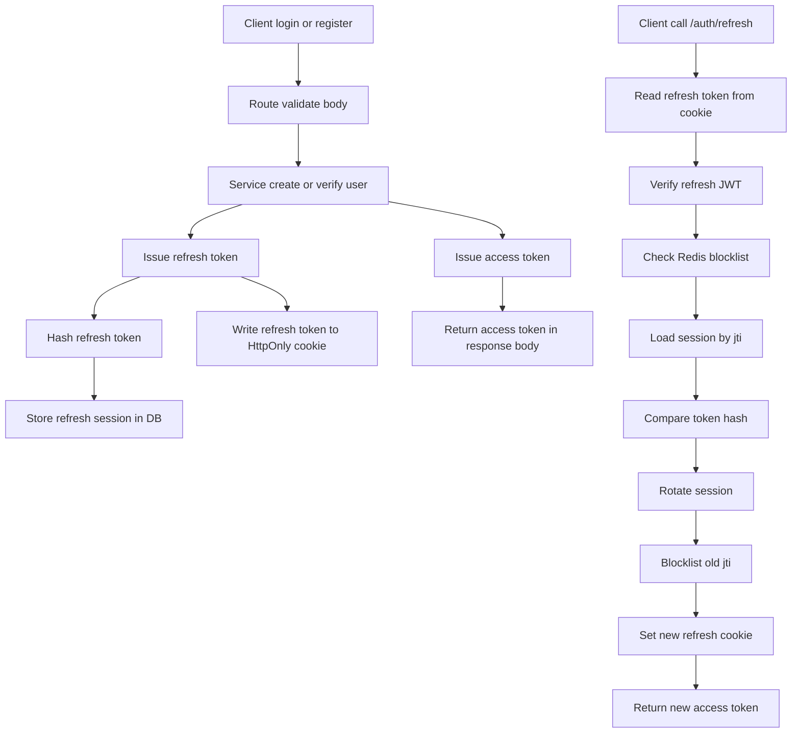

# Auth Module Documentation

Dokumen ini menjelaskan alur dan logika modul authentication di folder ini.

## Cara Baca Dokumen Ini

README ini sengaja disinkronkan dengan komentar bernomor di [route.ts](./route.ts).

Artinya:

- saat melihat angka seperti `[6.3.5]` di dokumen ini, cari komentar dengan angka yang sama di [route.ts](./route.ts)
- angka utamanya menunjukkan area besar
- angka turunannya menunjukkan langkah spesifik di dalam flow

Contoh cepat:

- `[1]` berarti constants dan local types
- `[5]` berarti helper auth bersama
- `[6.3]` berarti flow endpoint `/auth/refresh`
- `[6.3.11]` berarti blok kode rotasi session dan blocklist token lama

## Peta Nomor Di Source

Nomor utama yang dipakai di [route.ts](./route.ts):

1. `[1]` Constants & local types
2. `[2]` JWT payload helpers
3. `[3]` Refresh cookie helpers
4. `[4]` Request helpers
5. `[5]` JWT & auth guard helpers
6. `[6]` Routes
7. `[6.1]` `/auth/register`
8. `[6.2]` `/auth/login`
9. `[6.3]` `/auth/refresh`
10. `[6.4]` `/auth/logout`
11. `[6.5]` `/auth/me`
12. `[6.6]` `/auth/change-password`

## Tujuan Modul

Modul auth bertanggung jawab untuk:

- registrasi user baru
- login user
- menerbitkan access token dan refresh token
- menyimpan refresh session ke database
- melakukan refresh token rotation
- logout dan revoke token
- mengambil profil user login
- mengganti password user login

## Komponen Yang Terlibat

### Route layer

File [route.ts](./route.ts) menangani:

- validasi request awal dengan schema Zod
- orkestrasi flow auth
- baca dan tulis cookie refresh token
- generate JWT
- bentuk response sukses dan error

### Service layer

File [service.ts](./service.ts) menangani:

- query ke database via Prisma
- hashing password
- hashing refresh token sebelum disimpan
- blocklist token di Redis
- rotasi refresh session
- revoke session tunggal atau satu family session

### Schema layer

File [schema.ts](./schema.ts) menangani validasi input untuk:

- register
- login
- change password

### Shared utility

File [verifyAccessToken.ts](../../utils/verifyAccessToken.ts) dipakai untuk:

- memastikan header bearer token ada
- memverifikasi access token
- mengecek apakah JTI access token sudah masuk blocklist Redis

## Gambaran Besar Auth Strategy

Sistem ini memakai dua token:

- access token: dikembalikan di response body dan dipakai untuk request ke endpoint protected
- refresh token: disimpan di cookie `HttpOnly` dan dipakai hanya untuk endpoint `/auth/refresh`

Penyimpanan state token dibagi seperti ini:

- access token bersifat stateless, tetapi bisa dibatalkan dengan blocklist berdasarkan `jti`
- refresh token bersifat stateful, karena setiap token punya session record di database
- refresh token yang disimpan di database bukan token mentah, tetapi hash SHA-256 nya
- setiap refresh session punya `familyId` untuk mendeteksi dan menangani reuse atau compromise

## Data Yang Disimpan

### Di JWT

Access token dan refresh token sama-sama membawa payload minimal berikut:

- `sub`: user id dalam bentuk string
- `jti`: identifier unik token

Refresh token juga dipakai untuk mendapatkan `exp` agar server tahu kapan session berakhir.

### Di Cookie

Refresh token dikirim lewat cookie dengan karakteristik:

- nama cookie diambil dari `JWT_REFRESH_COOKIE_NAME`, default `refreshToken`
- `HttpOnly`
- `SameSite` diambil dari env, default `Lax`
- `Path` diambil dari env, default `/auth`
- `Secure` aktif kecuali `JWT_REFRESH_COOKIE_SECURE=false`

### Di Database Session

Refresh session menyimpan beberapa informasi penting:

- `jti`
- `familyId`
- `tokenHash`
- `expiresAt`
- `revokedAt`
- `replacedByJti`
- `rotatedFromJti`
- `userId`
- metadata client seperti `ipAddress` dan `userAgent`

### Di Redis Blocklist

Redis menyimpan key `blocklist:<jti>` dengan TTL sampai token kedaluwarsa. Ini dipakai untuk:

- access token yang di-logout
- refresh token lama yang sudah di-rotate
- token yang perlu langsung dianggap tidak valid

## Helper Penting Di Route

### `issueAccessAndRefreshTokens`

Kode terkait: `[5]`

Helper ini:

1. membuat `accessJti` dan `refreshJti`
2. sign access token dan refresh token
3. verify ulang refresh token untuk membaca `exp`
4. mengembalikan token beserta `expiresAt`

Output helper ini dipakai oleh flow register, login, dan refresh.

### `getAuthenticatedUserId`

Kode terkait: `[5]`

Helper ini dipakai untuk endpoint yang butuh access token valid, yaitu `/me` dan `/change-password`.

Langkahnya:

1. panggil utility `verifyAccessToken`
2. ambil bearer token dari header authorization
3. verify token
4. parse `sub` menjadi `userId`
5. jika gagal, kembalikan error auth

### `getClientMetadata`

Kode terkait: `[4]`

Helper ini mengambil metadata request dari header:

- `x-forwarded-for` atau `x-real-ip`
- `user-agent`

Metadata ini disimpan ke refresh session untuk kebutuhan audit dan security tracking.

## Flow Per Endpoint

### `/auth/register`

Kode terkait: `[6.1]`

Tujuan endpoint ini adalah membuat user baru lalu langsung meng-authenticate user tersebut.

Langkah detail:

1. `[6.1.1]` request body divalidasi dengan `registerSchema`
2. `[6.1.1]` service `register` membuat user baru dan hash password dengan `Bun.password.hash`
3. `[6.1.2]` route membuat access token dan refresh token baru
4. `[6.1.3]` route mengambil metadata client dari header
5. `[6.1.3]` route membuat refresh session baru di database dengan `familyId` baru
6. `[6.1.4]` refresh token mentah ditulis ke cookie `HttpOnly`
7. `[6.1.5]` access token dikembalikan di response body bersama data user
8. status response di-set ke `201`

Catatan penting:

- setelah register, user tidak perlu login ulang karena token langsung diterbitkan
- password tidak ikut dikembalikan ke response

### `/auth/login`

Kode terkait: `[6.2]`

Tujuan endpoint ini adalah memverifikasi kredensial lalu membuat pasangan token baru.

Langkah detail:

1. `[6.2.1]` route memilih schema login berdasarkan `method` yaitu `email` atau `username`
2. `[6.2.2]` service `login` mencari user berdasarkan identifier
3. `[6.2.2]` password diverifikasi dengan `Bun.password.verify`
4. jika kredensial salah, response `401`
5. `[6.2.3]` jika valid, route membuat access token dan refresh token
6. `[6.2.4]` route menyimpan refresh session baru ke database
7. `[6.2.5]` route menulis refresh token ke cookie
8. `[6.2.5]` route mengembalikan access token di response body

Catatan penting:

- satu login membuat satu refresh session baru
- token refresh yang disimpan di database tetap berbentuk hash, bukan plain token

### `/auth/refresh`

Kode terkait: `[6.3]`

Ini adalah flow paling penting karena di sinilah rotasi refresh token terjadi.

Tujuan endpoint ini adalah menukar refresh token lama menjadi access token baru dan refresh token baru.

Langkah detail:

1. `[6.3.1]` route membaca cookie dan mengambil refresh token mentah
2. jika cookie tidak ada, cookie dibersihkan dan response `401`
3. `[6.3.2]` refresh token diverifikasi dengan `refreshJwt.verify`
4. `[6.3.2]` route membaca `sub` sebagai `userId` dan `jti` sebagai `refreshJti`
5. jika token decode gagal atau payload tidak valid, cookie dibersihkan dan response `401`
6. `[6.3.3]` route mengecek apakah `refreshJti` ada di Redis blocklist
7. `[6.3.4]` route mengambil session berdasarkan `jti`
8. jika session tidak ada, token dianggap invalid
9. `[6.3.5]` route membandingkan hash token mentah dengan `tokenHash` di database
10. jika hash tidak cocok, seluruh family session di-revoke karena ini indikasi token reuse atau compromise
11. `[6.3.6]` jika session sudah revoked dan punya `replacedByJti`, seluruh family session ikut di-revoke
12. `[6.3.7]` jika session sudah expired, session itu di-revoke dan response `401`
13. `[6.3.8]` route memastikan user pemilik token masih ada
14. `[6.3.9]` route membuat pasangan token baru
15. `[6.3.11]` route menambahkan `jti` refresh token lama ke Redis blocklist
16. `[6.3.11]` route menjalankan `rotateRefreshSession`
17. `[6.3.11]` service menandai session lama sebagai revoked dan menyimpan `replacedByJti`
18. `[6.3.11]` service membuat session baru dengan `familyId` yang sama
19. `[6.3.12]` route menulis refresh token baru ke cookie
20. `[6.3.12]` route mengembalikan access token baru di response body

Kenapa flow ini cukup ketat:

- refresh token lama tidak boleh dipakai dua kali
- setiap rotasi meninggalkan jejak relasi session lama ke session baru
- jika ada indikasi penyalahgunaan, satu family token bisa dimatikan sekaligus

### `/auth/logout`

Kode terkait: `[6.4]`

Tujuan endpoint ini adalah mengakhiri sesi aktif secepat mungkin.

Langkah detail:

1. `[6.4.1]` route membaca refresh token dari cookie, jika ada
2. `[6.4.2]` refresh token diverifikasi untuk mengambil `jti` dan `exp`
3. `[6.4.2]` session refresh dengan `jti` tersebut di-revoke
4. `[6.4.2]` `jti` refresh token dimasukkan ke Redis blocklist sampai waktu expiry
5. route membaca access token dari header authorization, jika ada
6. `[6.4.3]` access token diverifikasi untuk mengambil `jti` dan `exp`
7. `[6.4.3]` `jti` access token juga dimasukkan ke Redis blocklist
8. `[6.4.4]` cookie refresh token dibersihkan
9. route mengembalikan response sukses

Catatan penting:

- logout tetap mencoba membersihkan dua sisi token, access dan refresh
- walaupun access token stateless, blocklist membuatnya bisa dibatalkan sebelum expiry alami

### `/auth/me`

Kode terkait: `[6.5]`

Tujuan endpoint ini adalah mengambil profil user yang sedang login.

Langkah detail:

1. `[6.5.1]` route memverifikasi access token dengan helper `getAuthenticatedUserId`
2. `[5]` helper memastikan token ada, valid, dan tidak di-blocklist
3. `[5]` user id diambil dari claim `sub`
4. `[6.5.2]` service mengambil data user berdasarkan id
5. jika user tidak ada, response `404`
6. jika ada, data user dikembalikan

### `/auth/change-password`

Kode terkait: `[6.6]`

Tujuan endpoint ini adalah mengganti password user yang sedang login.

Langkah detail:

1. `[6.6.1]` route memverifikasi access token dengan helper `getAuthenticatedUserId`
2. `[6.6.2]` request body divalidasi dengan `changePasswordSchema`
3. `[6.6.3]` service mengambil user dari database
4. `[6.6.3]` service memverifikasi `oldPassword`
5. jika password lama salah, response `401`
6. `[6.6.3]` jika valid, `newPassword` di-hash
7. `[6.6.3]` password user di-update di database
8. route mengembalikan data user terbaru

Catatan penting:

- flow ini belum otomatis me-revoke semua session lama setelah password berubah
- jika nanti ingin security lebih ketat, langkah berikutnya yang masuk akal adalah revoke seluruh refresh family milik user setelah password change

## Ringkasan Relasi Antar Layer

Berikut urutan tanggung jawabnya:

1. route menerima request dan melakukan parsing awal
2. schema memvalidasi input
3. service mengerjakan operasi database, hash, dan Redis
4. route mengatur JWT, cookie, dan format response

Singkatnya, route adalah orchestrator, service adalah executor logic yang menyentuh storage, dan utility menangani validasi auth yang dipakai ulang.

## Kontrak Response API

Semua endpoint auth mengembalikan wrapper response yang konsisten:

### Response sukses

```json
{
  "success": true,
  "message": "Authentication success",
  "data": {}
}
```

### Response error

```json
{
  "success": false,
  "code": "P2025",
  "message": "Access token is invalid",
  "error": null,
  "token": {
    "access": false,
    "refresh": false
  }
}
```

Catatan:

- field `token` bisa `null` jika error tidak terkait status token
- field `code` terisi jika sumber error berasal dari Prisma known error

## Contoh Request Cepat

### Register

```bash
curl -X POST "http://localhost:3000/auth/register" \
  -H "Content-Type: application/json" \
  -d '{
    "name": "John Doe",
    "email": "john@example.com",
    "username": "johndoe",
    "phone": "08123456789",
    "password": "Secret123!"
  }'
```

### Login

```bash
curl -X POST "http://localhost:3000/auth/login" \
  -H "Content-Type: application/json" \
  -d '{
    "method": "email",
    "identifier": "john@example.com",
    "password": "Secret123!"
  }'
```

### Me

```bash
curl -X GET "http://localhost:3000/auth/me" \
  -H "Authorization: Bearer <access_token>"
```

### Refresh

```bash
curl -X POST "http://localhost:3000/auth/refresh" \
  -H "Cookie: refreshToken=<refresh_token>"
```

### Logout

```bash
curl -X POST "http://localhost:3000/auth/logout" \
  -H "Authorization: Bearer <access_token>" \
  -H "Cookie: refreshToken=<refresh_token>"
```

## Mermaid Flow



## Hal Yang Perlu Diperhatikan Saat Mengubah Modul Ini

- jangan ubah format claim `sub` jika helper masih mengharapkan numeric user id dalam string
- jangan simpan refresh token mentah ke database
- rotasi refresh token harus tetap atomic agar session lama dan baru tidak bentrok
- kalau menambah endpoint protected, pakai helper auth yang sama supaya perilaku konsisten
- jika menambah logout all devices, basis logikanya ada di `familyId` dan revoke session per user

## Referensi Source

- [route.ts](./route.ts)
- [service.ts](./service.ts)
- [schema.ts](./schema.ts)
- [verifyAccessToken.ts](../../utils/verifyAccessToken.ts)
