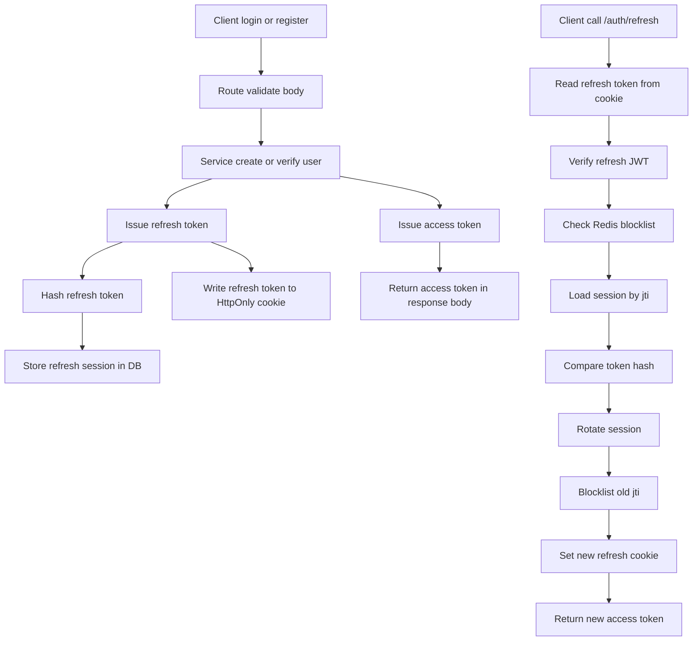

# Auth Module Documentation

This document explains the flow and logic of the authentication module in this folder.

## How to Read This Document

This README is intentionally kept in sync with the numbered comments in [route.ts](./route.ts).

Meaning:

- when you see a number like `[6.3.5]` in this document, find the comment with the same number in [route.ts](./route.ts)
- the main number indicates a larger area/section
- the sub-number indicates a specific step inside a flow

Quick examples:

- `[1]` means constants and local types
- `[5]` means shared auth helpers
- `[6.3]` means the `/auth/refresh` endpoint flow
- `[6.3.11]` means the refresh-session rotation + old token blocklisting block

## Source Numbering Map

Main numbers used in [route.ts](./route.ts):

1. `[1]` Constants & local types
2. `[2]` JWT payload helpers
3. `[3]` Refresh cookie helpers
4. `[4]` Request helpers
5. `[5]` JWT & auth guard helpers
6. `[6]` Routes
7. `[6.1]` `/auth/register`
8. `[6.2]` `/auth/login`
9. `[6.3]` `/auth/refresh`
10. `[6.4]` `/auth/logout`
11. `[6.5]` `/auth/me`
12. `[6.6]` `/auth/change-password`

## Module Responsibilities

The auth module is responsible for:

- registering new users
- logging users in
- issuing access tokens and refresh tokens
- persisting refresh sessions to the database
- rotating refresh tokens
- logging out and revoking tokens
- fetching the current authenticated user's profile
- changing the current authenticated user's password

## Components

### Route layer

The file [route.ts](./route.ts) handles:

- initial request validation using Zod schemas
- orchestrating auth flows
- reading/writing the refresh token cookie
- generating JWTs
- shaping success/error responses

### Service layer

The file [service.ts](./service.ts) handles:

- database queries via Prisma
- password hashing
- refresh token hashing before persisting
- token blocklisting in Redis
- refresh session rotation
- revoking a single session or an entire session family

### Schema layer

The file [schema.ts](./schema.ts) validates inputs for:

- register
- login
- change password

### Shared utility

The file [verifyAccessToken.ts](../../utils/verifyAccessToken.ts) is used to:

- ensure the bearer token header exists
- verify the access token
- check whether the access token JTI is present in the Redis blocklist

## High-Level Auth Strategy

This system uses two tokens:

- access token: returned in the response body and used to call protected endpoints
- refresh token: stored in an `HttpOnly` cookie and used only for `/auth/refresh`

Token state is handled as follows:

- access token is stateless, but can be invalidated via a blocklist by `jti`
- refresh token is stateful because each token has a session record in the database
- refresh tokens are not stored raw in the database; only their SHA-256 hash is stored
- each refresh session has a `familyId` to detect and handle reuse or compromise

## Stored Data

### In JWT

Both access and refresh tokens carry at least:

- `sub`: user id dalam bentuk string
- `jti`: identifier unik token

The refresh token is also used to read `exp` so the server knows when the session ends.

### In Cookie

Refresh tokens are sent via a cookie with these characteristics:

- cookie name comes from `JWT_REFRESH_COOKIE_NAME`, default `refreshToken`
- `HttpOnly`
- `SameSite` comes from env, default `Lax`
- `Path` comes from env, default `/auth`
- `Secure` is enabled unless `JWT_REFRESH_COOKIE_SECURE=false`

### In Session Database

Refresh sessions store these key fields:

- `jti`
- `familyId`
- `tokenHash`
- `expiresAt`
- `revokedAt`
- `replacedByJti`
- `rotatedFromJti`
- `userId`
- client metadata such as `ipAddress` and `userAgent`

### In Redis Blocklist

Redis stores `blocklist:<jti>` keys with a TTL until the token expires. This is used for:

- access tokens that were logged out
- old refresh tokens that were rotated
- tokens that must be considered invalid immediately

## Important Route Helpers

### `issueAccessAndRefreshTokens`

Related code: `[5]`

This helper:

1. creates `accessJti` and `refreshJti`
2. signs the access token and refresh token
3. re-verifies the refresh token to read `exp`
4. returns the tokens along with `expiresAt`

Its output is used by the register, login, and refresh flows.

### `getAuthenticatedUserId`

Related code: `[5]`

This helper is used by endpoints that require a valid access token: `/me` and `/change-password`.

Steps:

1. call the `verifyAccessToken` utility
2. extract the bearer token from the authorization header
3. verify the token
4. parse `sub` into `userId`
5. if anything fails, return an auth error

### `getClientMetadata`

Related code: `[4]`

This helper extracts request metadata from headers:

- `x-forwarded-for` atau `x-real-ip`
- `user-agent`

This metadata is stored in the refresh session for audit and security tracking.

## Per-Endpoint Flows

### `/auth/register`

Related code: `[6.1]`

This endpoint creates a new user and immediately authenticates them.

Detailed steps:

1. `[6.1.1]` validate the request body with `registerSchema`
2. `[6.1.1]` service `register` creates a new user and hashes the password with `Bun.password.hash`
3. `[6.1.2]` route issues a new access token and refresh token
4. `[6.1.3]` route extracts client metadata from headers
5. `[6.1.3]` route creates a new refresh session in the database with a new `familyId`
6. `[6.1.4]` write the raw refresh token to the `HttpOnly` cookie
7. `[6.1.5]` return the access token in the response body along with the user data
8. set the response status to `201`

Important notes:

- after register, the user doesn't need to log in again because tokens are issued immediately
- the password is never returned in the response

### `/auth/login`

Related code: `[6.2]`

This endpoint verifies credentials and creates a new token pair.

Detailed steps:

1. `[6.2.1]` route selects the login schema based on `method` (`email` or `username`)
2. `[6.2.2]` service `login` looks up the user by identifier
3. `[6.2.2]` verify the password with `Bun.password.verify`
4. if credentials are invalid, respond with `401`
5. `[6.2.3]` if valid, route issues an access token and refresh token
6. `[6.2.4]` route persists the new refresh session to the database
7. `[6.2.5]` route writes the refresh token to the cookie
8. `[6.2.5]` route returns the access token in the response body

Important notes:

- each login creates a new refresh session
- refresh tokens stored in the database are hashes, not plaintext tokens

### `/auth/refresh`

Related code: `[6.3]`

This is the most important flow because refresh token rotation happens here.

This endpoint exchanges an old refresh token for a new access token and a new refresh token.

Detailed steps:

1. `[6.3.1]` route reads the cookie and extracts the raw refresh token
2. if the cookie is missing, clear the cookie and respond with `401`
3. `[6.3.2]` verify the refresh token with `refreshJwt.verify`
4. `[6.3.2]` route reads `sub` as `userId` and `jti` as `refreshJti`
5. if decoding fails or the payload is invalid, clear the cookie and respond with `401`
6. `[6.3.3]` route mengecek apakah `refreshJti` ada di Redis blocklist
7. `[6.3.4]` route loads the session by `jti`
8. if the session doesn't exist, consider the token invalid
9. `[6.3.5]` route membandingkan hash token mentah dengan `tokenHash` di database
10. if the hash doesn't match, revoke the entire session family (token reuse/compromise signal)
11. `[6.3.6]` if the session is revoked and has `replacedByJti`, revoke the entire family as well
12. `[6.3.7]` if the session is expired, revoke it and respond with `401`
13. `[6.3.8]` route ensures the token owner user still exists
14. `[6.3.9]` route issues a new token pair
15. `[6.3.11]` route menambahkan `jti` refresh token lama ke Redis blocklist
16. `[6.3.11]` route menjalankan `rotateRefreshSession`
17. `[6.3.11]` service marks the old session as revoked and stores `replacedByJti`
18. `[6.3.11]` service creates a new session with the same `familyId`
19. `[6.3.12]` route writes the new refresh token to the cookie
20. `[6.3.12]` route mengembalikan access token baru di response body

Why this flow is strict:

- an old refresh token must never be usable twice
- every rotation leaves a trace linking old sessions to new sessions
- if abuse is detected, the entire token family can be revoked at once

### `/auth/logout`

Related code: `[6.4]`

This endpoint terminates the active session as quickly as possible.

Detailed steps:

1. `[6.4.1]` the route reads the refresh token from the cookie, if present
2. `[6.4.2]` verify the refresh token to extract `jti` and `exp`
3. `[6.4.2]` revoke the refresh session for that `jti`
4. `[6.4.2]` add the refresh token `jti` to the Redis blocklist until expiry
5. route reads the access token from the authorization header, if present
6. `[6.4.3]` verify the access token to extract `jti` and `exp`
7. `[6.4.3]` add the access token `jti` to the Redis blocklist as well
8. `[6.4.4]` the refresh cookie is cleared
9. route returns a success response

Important notes:

- logout attempts to invalidate both token types: access and refresh
- even though the access token is stateless, blocklisting allows early invalidation before natural expiry

### `/auth/me`

Related code: `[6.5]`

This endpoint fetches the profile of the currently authenticated user.

Detailed steps:

1. `[6.5.1]` route verifies the access token using the `getAuthenticatedUserId` helper
2. `[5]` helper ensures the token exists, is valid, and is not blocklisted
3. `[5]` user id diambil dari claim `sub`
4. `[6.5.2]` service fetches the user data by id
5. if the user doesn't exist, respond with `404`
6. otherwise return the user data

### `/auth/change-password`

Related code: `[6.6]`

This endpoint changes the password of the currently authenticated user.

Detailed steps:

1. `[6.6.1]` route verifies the access token using the `getAuthenticatedUserId` helper
2. `[6.6.2]` validate the request body with `changePasswordSchema`
3. `[6.6.3]` service loads the user from the database
4. `[6.6.3]` service memverifikasi `oldPassword`
5. if the old password is incorrect, respond with `401`
6. `[6.6.3]` jika valid, `newPassword` di-hash
7. `[6.6.3]` update the user's password in the database
8. route returns the updated user data

Important notes:

- this flow does not yet automatically revoke all previous sessions after a password change
- for stricter security, the next sensible step is revoking the user's entire refresh family after a password change

## Summary of Layer Responsibilities

Order of responsibilities:

1. route receives the request and performs initial parsing
2. schema validates input
3. service performs database operations, hashing, and Redis operations
4. route manages JWTs, cookies, and response formatting

In short: the route is the orchestrator, the service is the executor that touches storage, and utilities provide reusable auth validation.

## API Response Contract

All auth endpoints return a consistent response wrapper:

### Response sukses

```json
{
  "success": true,
  "message": "Authentication success",
  "data": {}
}
```

### Response error

```json
{
  "success": false,
  "code": "P2025",
  "message": "Access token is invalid",
  "error": null,
  "token": {
    "access": false,
    "refresh": false
  }
}
```

Notes:

- `token` can be `null` if the error is not related to token status
- `code` is present when the error originates from a Prisma known error

## Quick Request Examples

### Register

```bash
curl -X POST "http://localhost:3000/auth/register" \
  -H "Content-Type: application/json" \
  -d '{
    "name": "John Doe",
    "email": "john@example.com",
    "username": "johndoe",
    "phone": "08123456789",
    "password": "Secret123!"
  }'
```

### Login

```bash
curl -X POST "http://localhost:3000/auth/login" \
  -H "Content-Type: application/json" \
  -d '{
    "method": "email",
    "identifier": "john@example.com",
    "password": "Secret123!"
  }'
```

### Me

```bash
curl -X GET "http://localhost:3000/auth/me" \
  -H "Authorization: Bearer <access_token>"
```

### Refresh

```bash
curl -X POST "http://localhost:3000/auth/refresh" \
  -H "Cookie: refreshToken=<refresh_token>"
```

### Logout

```bash
curl -X POST "http://localhost:3000/auth/logout" \
  -H "Authorization: Bearer <access_token>" \
  -H "Cookie: refreshToken=<refresh_token>"
```

## Mermaid Flow



## Things to Watch When Modifying This Module

- do not change the `sub` claim format while helpers expect a numeric user id encoded as a string
- never store raw refresh tokens in the database
- refresh token rotation must remain atomic so old/new sessions don't conflict
- when adding protected endpoints, reuse the same auth helpers for consistent behavior
- if adding "logout all devices", base the logic on `familyId` and revoking sessions per user

## Referensi Source

- [route.ts](./route.ts)
- [service.ts](./service.ts)
- [schema.ts](./schema.ts)
- [verifyAccessToken.ts](../../utils/verifyAccessToken.ts)
