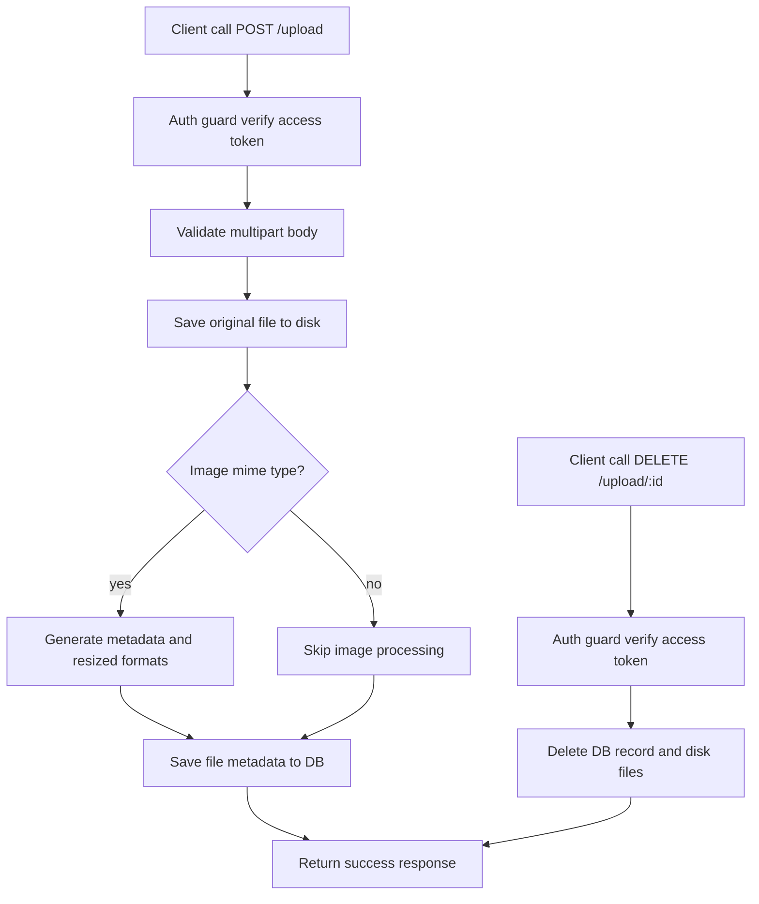

# Upload Module Documentation

This document explains the flow and logic of the upload module in this folder.

## How to Read This Document

This README is kept in sync with the numbered comments in [route.ts](./route.ts) and [service.ts](./service.ts).

Meaning:

- when you see a number like `[2.4.2]` in this document, find the comment with the same number in the source
- the main number indicates a larger module area/section
- the sub-number indicates detailed steps inside a flow

Quick examples:

- `[1]` means constants and upload helpers
- `[2.1]` means the delete-file flow in the service
- `[2.6]` means the `POST /upload` endpoint in the route
- `[2.4.2]` means the image metadata + multi-format resize process

## Source Numbering Map

Main numbers used in the source:

1. `[1]` Constants & helpers
2. `[2]` Service utama upload
3. `[2.1]` `service.delete`
4. `[2.2]` `service.getAll`
5. `[2.3]` `service.getById`
6. `[2.4]` `service.upload`
7. `[2.1]` Error handler route
8. `[2.2]` Auth guard route
9. `[2.3]` `DELETE /upload/:id`
10. `[2.4]` `GET /upload`
11. `[2.5]` `GET /upload/:id`
12. `[2.6]` `POST /upload`

## Module Responsibilities

The upload module is responsible for:

- saving files to disk
- storing file metadata in the database
- processing image files into multiple derived sizes
- providing list, detail, and delete endpoints
- ensuring all endpoints are accessible only to authenticated users

## Components

### Route layer

The file [route.ts](./route.ts) handles:

- auth guard via access token verification
- request param and body validation
- calling the upload service
- shaping success/error responses

### Service layer

The file [service.ts](./service.ts) handles:

- database operations for the `files` table
- filesystem operations (save/delete files)
- extracting image metadata
- generating derived image formats (`thumbnail`, `small`, `medium`, `large`)

### Schema layer

The file [schema.ts](./schema.ts) validates inputs for:

- id params for detail/delete endpoints
- multipart upload payloads

## High-Level Upload Strategy

Upload strategy:

- the original file is always saved under the `uploads` directory
- if the MIME type is an image, the system generates additional visual metadata
- images larger than the format widths are resized into multiple WebP variants
- full metadata (path, size, dimensions, placeholder, dominant color, formats) is stored in the DB

## Per-Endpoint Flows

### `POST /upload`

Related code: `[2.6]` route, `[2.4]` service.

Detailed steps:

1. `[2.2.1]` auth guard verifies the access token
2. `[2.6.1]` route validates the upload body
3. `[2.6.2]` route calls `service.upload(file)`
4. `[2.4.1]` service saves the original file to disk
5. `[2.4.2]` if the file is an image, service extracts metadata and generates derived formats
6. `[2.4.3]` service persists file metadata to the database
7. route returns a success `created` response

### `GET /upload`

Related code: `[2.4]` route, `[2.2]` service.

Detailed steps:

1. `[2.2.1]` auth guard verifies the access token
2. `[2.4.1]` route calls `service.getAll()`
3. service returns a list of files ordered by newest
4. route returns a success `retrieved` response

### `GET /upload/:id`

Related code: `[2.5]` route, `[2.3]` service.

Detailed steps:

1. `[2.2.1]` auth guard verifies the access token
2. `[2.5.1]` route validates the `id` param
3. `[2.5.2]` route calls `service.getById(id)`
4. route returns a success `retrieved` response

### `DELETE /upload/:id`

Related code: `[2.3]` route, `[2.1]` service.

Detailed steps:

1. `[2.2.1]` auth guard verifies the access token
2. `[2.3.1]` route validates the `id` param
3. `[2.3.2]` route calls `service.delete(id)`
4. `[2.1.1]` service deletes the primary file from disk
5. `[2.1.2]` service deletes all derived formats if present
6. service deletes the file record from the database
7. route returns a success `deleted` response

## API Response Contract

All upload endpoints return a consistent response wrapper:

### Response sukses

```json
{
  "success": true,
  "message": "Upload created successfully",
  "data": {}
}
```

### Response error

```json
{
  "success": false,
  "code": "P2025",
  "message": "Upload not found",
  "error": null,
  "token": null
}
```

## Quick Request Examples

All endpoints require this header:

```bash
Authorization: Bearer <access_token>
```

### Upload a file

```bash
curl -X POST "http://localhost:3000/upload" \
  -H "Authorization: Bearer <access_token>" \
  -F "file=@./example-image.jpg"
```

### Get all files

```bash
curl -X GET "http://localhost:3000/upload" \
  -H "Authorization: Bearer <access_token>"
```

### Get a file by id

```bash
curl -X GET "http://localhost:3000/upload/1" \
  -H "Authorization: Bearer <access_token>"
```

### Delete a file by id

```bash
curl -X DELETE "http://localhost:3000/upload/1" \
  -H "Authorization: Bearer <access_token>"
```

## Mermaid Flow



## Things to Watch When Modifying This Module

- do not change the `formats` structure without updating the frontend consumer
- when adding new image formats, ensure delete logic also cleans them up
- avoid saving files without `mkdir` recursive, since deployment environments can be stateless
- MIME type validation must remain strict to prevent unwanted file processing

## Referensi Source

- [route.ts](./route.ts)
- [service.ts](./service.ts)
- [schema.ts](./schema.ts)
- [type.ts](./type.ts)
