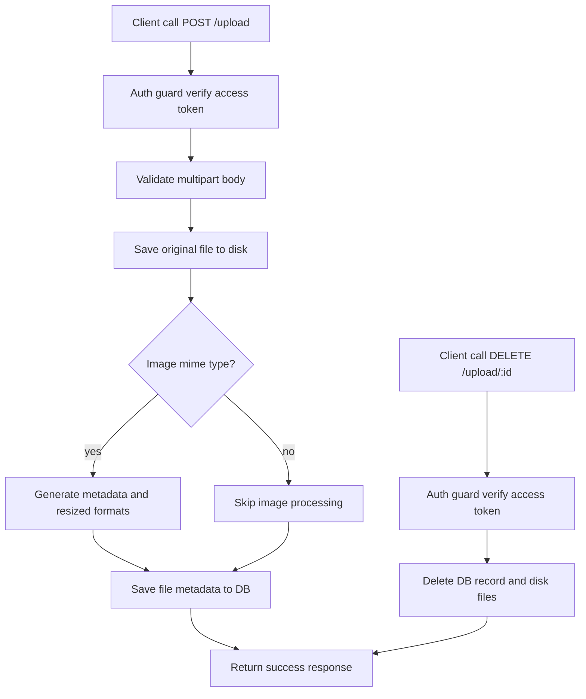

# Upload Module Documentation

Dokumen ini menjelaskan alur dan logika modul upload di folder ini.

## Cara Baca Dokumen Ini

README ini disinkronkan dengan komentar bernomor di [route.ts](./route.ts) dan [service.ts](./service.ts).

Artinya:

- saat melihat angka seperti `[2.4.2]` di dokumen ini, cari komentar dengan angka yang sama di source
- angka utama menunjukkan area besar modul
- angka turunan menunjukkan langkah detail di dalam flow

Contoh cepat:

- `[1]` berarti constants dan helper upload
- `[2.1]` berarti flow hapus file di service
- `[2.6]` berarti endpoint `POST /upload` di route
- `[2.4.2]` berarti proses metadata image dan resize multi-format

## Peta Nomor Di Source

Nomor utama yang dipakai di source:

1. `[1]` Constants & helpers
2. `[2]` Service utama upload
3. `[2.1]` `service.delete`
4. `[2.2]` `service.getAll`
5. `[2.3]` `service.getById`
6. `[2.4]` `service.upload`
7. `[2.1]` Error handler route
8. `[2.2]` Auth guard route
9. `[2.3]` `DELETE /upload/:id`
10. `[2.4]` `GET /upload`
11. `[2.5]` `GET /upload/:id`
12. `[2.6]` `POST /upload`

## Tujuan Modul

Modul upload bertanggung jawab untuk:

- menyimpan file ke disk
- menyimpan metadata file ke database
- memproses file gambar menjadi beberapa ukuran turunan
- menyediakan endpoint baca, detail, dan hapus file
- memastikan semua endpoint hanya bisa diakses user yang terautentikasi

## Komponen Yang Terlibat

### Route layer

File [route.ts](./route.ts) menangani:

- auth guard dengan verifikasi access token
- validasi request param dan body
- pemanggilan service upload
- pembentukan response sukses/error

### Service layer

File [service.ts](./service.ts) menangani:

- operasi database tabel `files`
- operasi filesystem (simpan dan hapus file)
- ekstraksi metadata gambar
- pembuatan format turunan image (`thumbnail`, `small`, `medium`, `large`)

### Schema layer

File [schema.ts](./schema.ts) menangani validasi input untuk:

- id param endpoint detail/delete
- payload upload multipart

## Gambaran Besar Upload Strategy

Strategi upload yang dipakai:

- file original selalu disimpan ke direktori `uploads`
- jika MIME type termasuk image, sistem akan membuat metadata visual tambahan
- image yang lebih besar dari batas ukuran tertentu di-resize ke beberapa format webp
- metadata lengkap (path, ukuran, dimensi, placeholder, dominant color, formats) disimpan ke DB

## Flow Per Endpoint

### `POST /upload`

Kode terkait: `[2.6]` route, `[2.4]` service.

Langkah detail:

1. `[2.2.1]` auth guard memverifikasi access token
2. `[2.6.1]` route memvalidasi body upload
3. `[2.6.2]` route memanggil `service.upload(file)`
4. `[2.4.1]` service menyimpan file original ke disk
5. `[2.4.2]` jika file image, service ambil metadata dan buat format turunan
6. `[2.4.3]` service simpan metadata file ke database
7. route mengembalikan response sukses `created`

### `GET /upload`

Kode terkait: `[2.4]` route, `[2.2]` service.

Langkah detail:

1. `[2.2.1]` auth guard memverifikasi access token
2. `[2.4.1]` route memanggil `service.getAll()`
3. service mengembalikan daftar file urut terbaru
4. route mengembalikan response sukses `retrieved`

### `GET /upload/:id`

Kode terkait: `[2.5]` route, `[2.3]` service.

Langkah detail:

1. `[2.2.1]` auth guard memverifikasi access token
2. `[2.5.1]` route memvalidasi param `id`
3. `[2.5.2]` route memanggil `service.getById(id)`
4. route mengembalikan response sukses `retrieved`

### `DELETE /upload/:id`

Kode terkait: `[2.3]` route, `[2.1]` service.

Langkah detail:

1. `[2.2.1]` auth guard memverifikasi access token
2. `[2.3.1]` route memvalidasi param `id`
3. `[2.3.2]` route memanggil `service.delete(id)`
4. `[2.1.1]` service menghapus file utama dari disk
5. `[2.1.2]` service menghapus semua format turunan jika ada
6. service menghapus record file di database
7. route mengembalikan response sukses `deleted`

## Kontrak Response API

Semua endpoint upload mengembalikan wrapper response yang konsisten:

### Response sukses

```json
{
  "success": true,
  "message": "Upload created successfully",
  "data": {}
}
```

### Response error

```json
{
  "success": false,
  "code": "P2025",
  "message": "Upload not found",
  "error": null,
  "token": null
}
```

## Contoh Request Cepat

Semua endpoint butuh header:

```bash
Authorization: Bearer <access_token>
```

### Upload file

```bash
curl -X POST "http://localhost:3000/upload" \
  -H "Authorization: Bearer <access_token>" \
  -F "file=@./contoh-gambar.jpg"
```

### Ambil semua file

```bash
curl -X GET "http://localhost:3000/upload" \
  -H "Authorization: Bearer <access_token>"
```

### Ambil file by id

```bash
curl -X GET "http://localhost:3000/upload/1" \
  -H "Authorization: Bearer <access_token>"
```

### Hapus file by id

```bash
curl -X DELETE "http://localhost:3000/upload/1" \
  -H "Authorization: Bearer <access_token>"
```

## Mermaid Flow



## Hal Yang Perlu Diperhatikan Saat Mengubah Modul Ini

- jangan ubah struktur `formats` tanpa menyesuaikan consumer di frontend
- saat menambah format image baru, pastikan logika delete ikut membersihkan format tersebut
- hindari menyimpan file tanpa `mkdir` recursive karena deployment environment bisa stateless
- validasi MIME type harus tetap ketat untuk mencegah file processing yang tidak diinginkan

## Referensi Source

- [route.ts](./route.ts)
- [service.ts](./service.ts)
- [schema.ts](./schema.ts)
- [type.ts](./type.ts)
