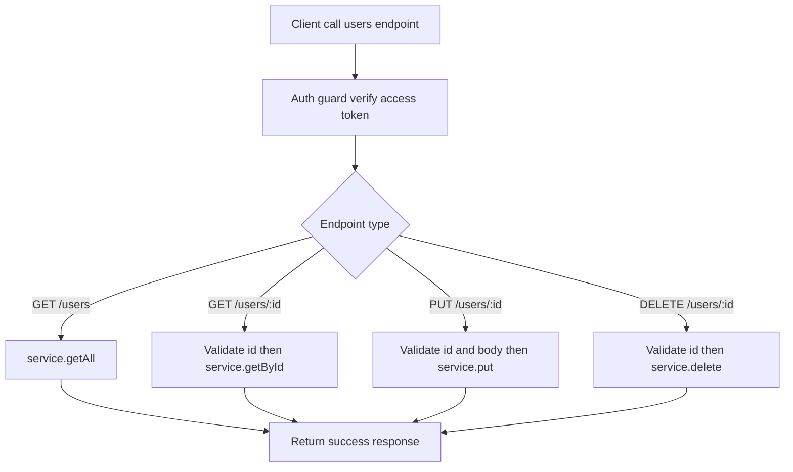

# Users Module Documentation

Dokumen ini menjelaskan alur dan logika modul users di folder ini.

## Cara Baca Dokumen Ini

README ini disinkronkan dengan komentar bernomor di [route.ts](./route.ts) dan [service.ts](./service.ts).

Artinya:

- saat melihat angka seperti `[2.6.2]` di dokumen ini, cari komentar dengan angka yang sama di source
- angka utama menunjukkan area besar modul
- angka turunan menunjukkan langkah detail di dalam flow

Contoh cepat:

- `[1]` berarti service utama users
- `[1.4]` berarti flow update user di service
- `[2.2]` berarti auth guard untuk semua endpoint users
- `[2.6]` berarti endpoint `PUT /users/:id`

## Peta Nomor Di Source

Nomor utama yang dipakai di source:

1. `[1]` Service utama users
2. `[1.1]` `service.delete`
3. `[1.2]` `service.getAll`
4. `[1.3]` `service.getById`
5. `[1.4]` `service.put`
6. `[2.1]` Error handler route
7. `[2.2]` Auth guard route
8. `[2.3]` `DELETE /users/:id`
9. `[2.4]` `GET /users`
10. `[2.5]` `GET /users/:id`
11. `[2.6]` `PUT /users/:id`

## Tujuan Modul

Modul users bertanggung jawab untuk:

- menyediakan endpoint CRUD data user (tanpa create karena ditangani auth)
- mengambil daftar user dan detail user
- memperbarui profil user berdasarkan id
- menghapus user berdasarkan id
- memastikan response user tidak membocorkan field sensitif

## Komponen Yang Terlibat

### Route layer

File [route.ts](./route.ts) menangani:

- auth guard dengan verifikasi access token
- validasi request param dan body
- pemanggilan service users
- pembentukan response sukses/error

### Service layer

File [service.ts](./service.ts) menangani:

- query database tabel `users`
- include relasi image user
- omit field sensitif melalui `AUTH_OMIT_FIELDS`
- operasi delete, getAll, getById, dan put

### Schema layer

File [schema.ts](./schema.ts) menangani validasi input untuk:

- param id endpoint users
- payload update user

## Gambaran Besar Users Strategy

Strategi modul users:

- semua endpoint diproteksi access token
- semua operasi data user berpusat di service untuk menjaga konsistensi query
- response user selalu melalui rule omit field auth sensitif
- update user mendukung relasi `imageId`, termasuk set ke `null`

## Flow Per Endpoint

### `GET /users`

Kode terkait: `[2.4]` route, `[1.2]` service.

Langkah detail:

1. `[2.2.1]` auth guard memverifikasi access token
2. `[2.4.1]` route memanggil `service.getAll()`
3. service mengambil semua user urut id asc
4. route mengembalikan response sukses `retrieved`

### `GET /users/:id`

Kode terkait: `[2.5]` route, `[1.3]` service.

Langkah detail:

1. `[2.2.1]` auth guard memverifikasi access token
2. `[2.5.1]` route memvalidasi param `id`
3. `[2.5.2]` route memanggil `service.getById(id)`
4. route mengembalikan response sukses `retrieved`

### `PUT /users/:id`

Kode terkait: `[2.6]` route, `[1.4]` service.

Langkah detail:

1. `[2.2.1]` auth guard memverifikasi access token
2. `[2.6.1]` route memvalidasi param `id` dan body payload
3. `[2.6.2]` route memanggil `service.put(id, payload)`
4. service update data user dan relasi `imageId`
5. route mengembalikan response sukses `updated`

### `DELETE /users/:id`

Kode terkait: `[2.3]` route, `[1.1]` service.

Langkah detail:

1. `[2.2.1]` auth guard memverifikasi access token
2. `[2.3.1]` route memvalidasi param `id`
3. `[2.3.2]` route memanggil `service.delete(id)`
4. route mengembalikan response sukses `deleted`

## Kontrak Response API

Semua endpoint users mengembalikan wrapper response yang konsisten:

### Response sukses

```json
{
  "success": true,
  "message": "Users retrieved successfully",
  "data": {}
}
```

### Response error

```json
{
  "success": false,
  "code": "P2025",
  "message": "Users not found",
  "error": null,
  "token": null
}
```

## Contoh Request Cepat

Semua endpoint butuh header:

```bash
Authorization: Bearer <access_token>
```

### Ambil semua user

```bash
curl -X GET "http://localhost:3000/users" \
  -H "Authorization: Bearer <access_token>"
```

### Ambil user by id

```bash
curl -X GET "http://localhost:3000/users/1" \
  -H "Authorization: Bearer <access_token>"
```

### Update user

```bash
curl -X PUT "http://localhost:3000/users/1" \
  -H "Authorization: Bearer <access_token>" \
  -H "Content-Type: application/json" \
  -d '{
    "name": "John Updated",
    "phone": "08123456789",
    "imageId": 12
  }'
```

### Hapus user

```bash
curl -X DELETE "http://localhost:3000/users/1" \
  -H "Authorization: Bearer <access_token>"
```

## Mermaid Flow



## Hal Yang Perlu Diperhatikan Saat Mengubah Modul Ini

- jangan hapus `omit: AUTH_OMIT_FIELDS` karena field auth sensitif harus tetap tersembunyi
- jika menambah field payload update, selaraskan schema dan type agar tidak mismatch
- perubahan relasi `imageId` harus tetap kompatibel dengan nilai `null`
- bila menambah endpoint baru, tetap gunakan auth guard yang sama untuk konsistensi security

## Referensi Source

- [route.ts](./route.ts)
- [service.ts](./service.ts)
- [schema.ts](./schema.ts)
- [type.ts](./type.ts)
