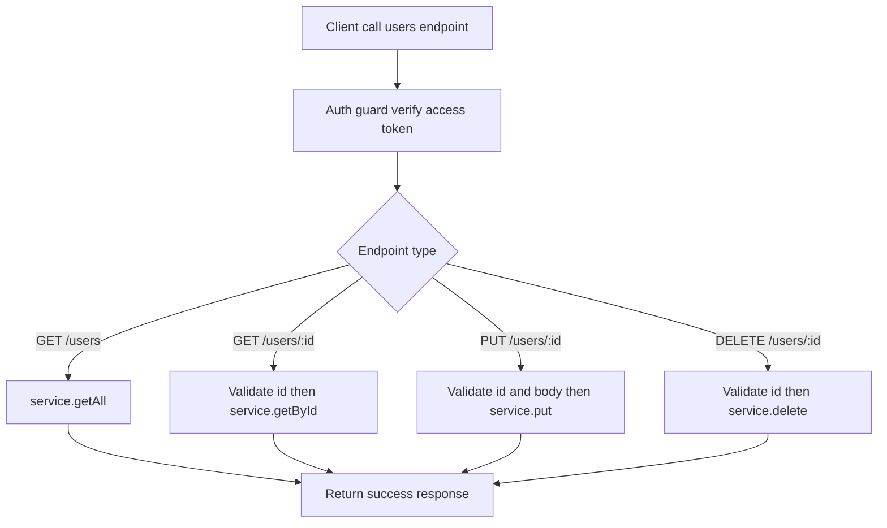

# Users Module Documentation

This document explains the flow and logic of the users module in this folder.

## How to Read This Document

This README is kept in sync with the numbered comments in [route.ts](./route.ts) and [service.ts](./service.ts).

Meaning:

- when you see a number like `[2.6.2]` in this document, find the comment with the same number in the source
- the main number indicates a larger module area/section
- the sub-number indicates detailed steps inside a flow

Quick examples:

- `[1]` means the primary users service
- `[1.4]` means the update-user flow in the service
- `[2.2]` means the auth guard for all users endpoints
- `[2.6]` means the `PUT /users/:id` endpoint

## Source Numbering Map

Main numbers used in the source:

1. `[1]` Service utama users
2. `[1.1]` `service.delete`
3. `[1.2]` `service.getAll`
4. `[1.3]` `service.getById`
5. `[1.4]` `service.put`
6. `[2.1]` Error handler route
7. `[2.2]` Auth guard route
8. `[2.3]` `DELETE /users/:id`
9. `[2.4]` `GET /users`
10. `[2.5]` `GET /users/:id`
11. `[2.6]` `PUT /users/:id`

## Module Responsibilities

The users module is responsible for:

- providing CRUD endpoints for user data (without create, which is handled by auth)
- listing users and retrieving user details
- updating a user profile by id
- deleting a user by id
- ensuring user responses do not leak sensitive fields

## Components

### Route layer

The file [route.ts](./route.ts) handles:

- auth guard via access token verification
- request param and body validation
- calling the users service
- shaping success/error responses

### Service layer

The file [service.ts](./service.ts) handles:

- database queries for the `users` table
- including the user's image relation
- omitting sensitive fields via `AUTH_OMIT_FIELDS`
- delete, getAll, getById, and put operations

### Schema layer

The file [schema.ts](./schema.ts) validates inputs for:

- users endpoint id params
- user update payloads

## High-Level Users Strategy

The users module strategy:

- all endpoints are protected by an access token
- all user data operations go through the service to keep queries consistent
- user responses always omit sensitive auth fields
- update supports the `imageId` relation, including setting it to `null`

## Per-Endpoint Flows

### `GET /users`

Related code: `[2.4]` route, `[1.2]` service.

Detailed steps:

1. `[2.2.1]` auth guard verifies the access token
2. `[2.4.1]` route calls `service.getAll()`
3. service fetches all users ordered by id ascending
4. route returns a success `retrieved` response

### `GET /users/:id`

Related code: `[2.5]` route, `[1.3]` service.

Detailed steps:

1. `[2.2.1]` auth guard verifies the access token
2. `[2.5.1]` route validates the `id` param
3. `[2.5.2]` route calls `service.getById(id)`
4. route returns a success `retrieved` response

### `PUT /users/:id`

Related code: `[2.6]` route, `[1.4]` service.

Detailed steps:

1. `[2.2.1]` auth guard verifies the access token
2. `[2.6.1]` route validates the `id` param and request body
3. `[2.6.2]` route calls `service.put(id, payload)`
4. service updates user data and the `imageId` relation
5. route returns a success `updated` response

### `DELETE /users/:id`

Related code: `[2.3]` route, `[1.1]` service.

Detailed steps:

1. `[2.2.1]` auth guard verifies the access token
2. `[2.3.1]` route validates the `id` param
3. `[2.3.2]` route calls `service.delete(id)`
4. route returns a success `deleted` response

## API Response Contract

All users endpoints return a consistent response wrapper:

### Response sukses

```json
{
  "success": true,
  "message": "Users retrieved successfully",
  "data": {}
}
```

### Response error

```json
{
  "success": false,
  "code": "P2025",
  "message": "Users not found",
  "error": null,
  "token": null
}
```

## Quick Request Examples

All endpoints require this header:

```bash
Authorization: Bearer <access_token>
```

### Get all users

```bash
curl -X GET "http://localhost:3000/users" \
  -H "Authorization: Bearer <access_token>"
```

### Get a user by id

```bash
curl -X GET "http://localhost:3000/users/1" \
  -H "Authorization: Bearer <access_token>"
```

### Update a user

```bash
curl -X PUT "http://localhost:3000/users/1" \
  -H "Authorization: Bearer <access_token>" \
  -H "Content-Type: application/json" \
  -d '{
    "name": "John Updated",
    "phone": "08123456789",
    "imageId": 12
  }'
```

### Delete a user

```bash
curl -X DELETE "http://localhost:3000/users/1" \
  -H "Authorization: Bearer <access_token>"
```

## Mermaid Flow



## Things to Watch When Modifying This Module

- do not remove `omit: AUTH_OMIT_FIELDS` because sensitive auth fields must remain hidden
- when adding payload fields, keep schema and types aligned to avoid mismatches
- changes to the `imageId` relation must remain compatible with `null`
- when adding new endpoints, keep using the same auth guard for consistent security

## Referensi Source

- [route.ts](./route.ts)
- [service.ts](./service.ts)
- [schema.ts](./schema.ts)
- [type.ts](./type.ts)
